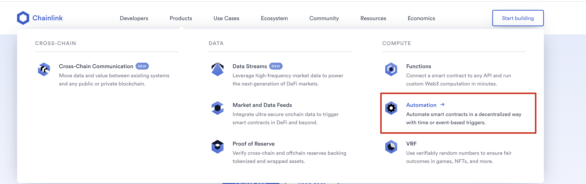
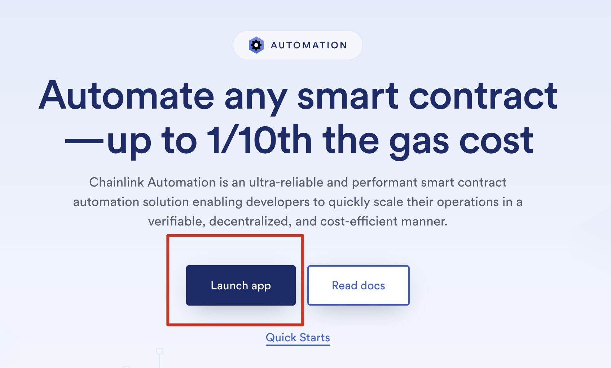
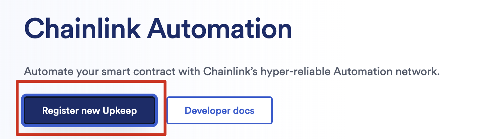
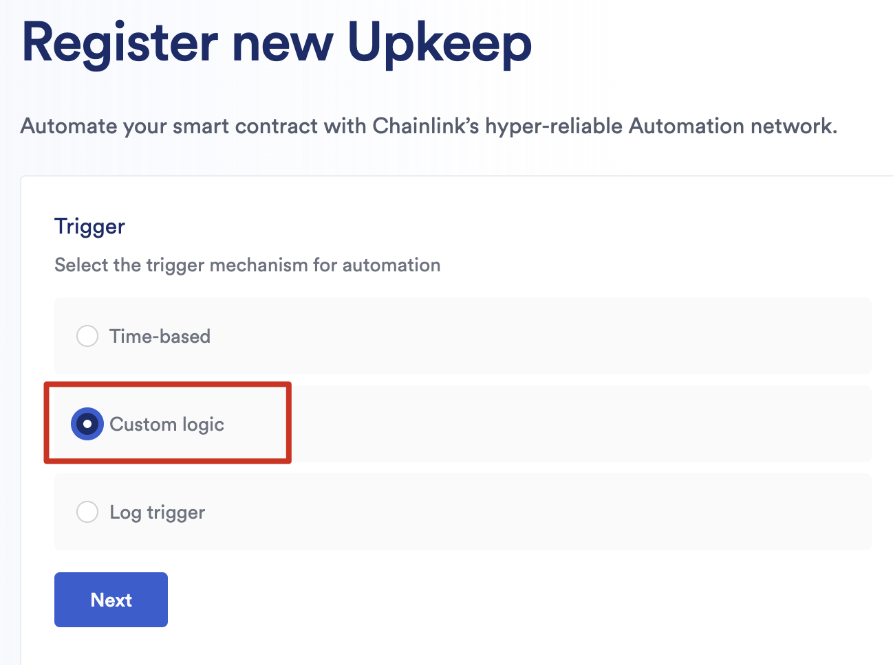
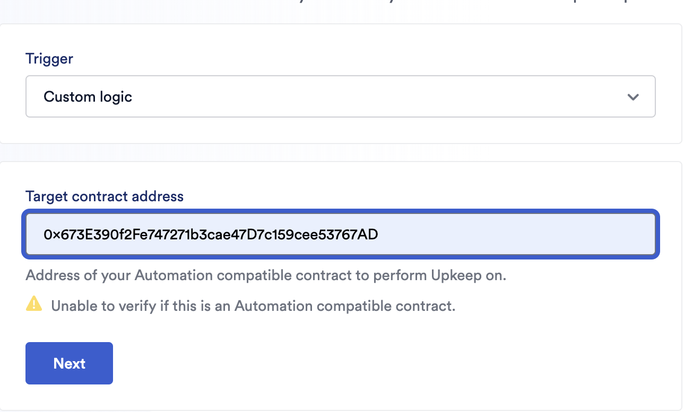
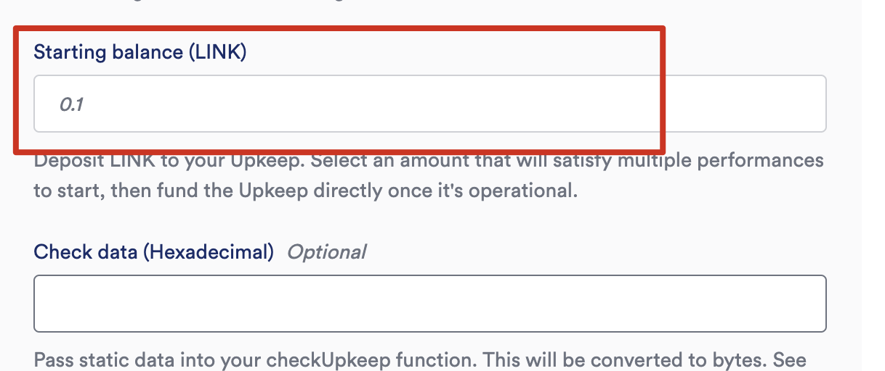

chainlink实现定时任务
第一步：导入 import "@chainlink/contracts/src/v0.8/AutomationCompatible.sol";
第二步：继承 AutomationCompatibleInterface
第三步：实现checkUpkeep（执行条件）、performUpkeep（条件满足后的执行逻辑）方法，link余额要够大
第四步：创建

